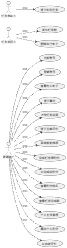
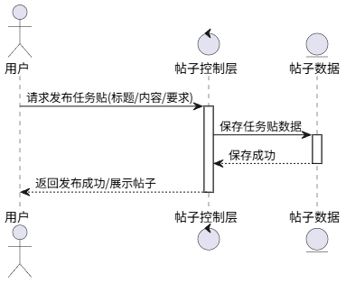
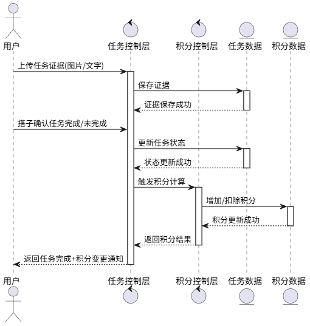
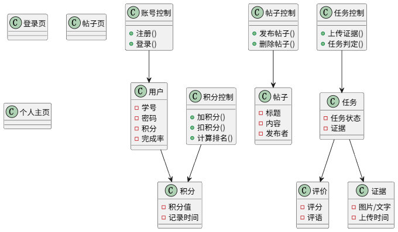
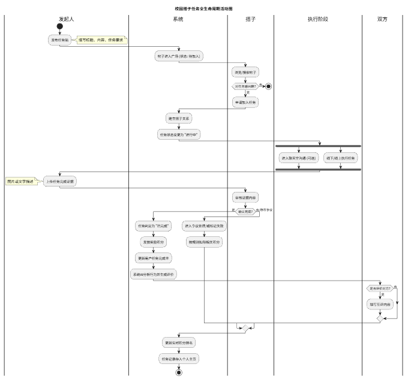

# 软件需求规格说明书

**项目名称**：校园搭子任务互助平台（Task Buddy）
**文档版本**：v1.0
**编写小组**：第 5 组
**日期**：2026-05-13

---

## 目录

1. [引言](#1-引言)
2. [总体需求描述](#2-总体需求描述)
3. [功能性需求描述](#3-功能性需求描述)
4. [非功能性需求描述](#4-非功能性需求描述)
5. [系统需求模型](#5-系统需求模型)
6. [外部接口需求与数据字典](#6-外部接口需求与数据字典)
7. [需求追踪矩阵](#7-需求追踪矩阵)
8. [需求变更管理](#8-需求变更管理)

---

## 1 引言

### 1.1 项目背景与目标

**背景**：当前校园学生普遍存在学习、生活任务拖延、缺乏监督、找不到同伴的痛点，缺少轻量化、易用的校园任务互助工具。

**目标**：搭建校园搭子任务互助平台，实现注册登录、发帖组队、任务打卡、积分奖惩、排名激励、搭子互动等功能，提升学生任务完成率与自律性。

### 1.2 文档目的与范围

本文档明确系统全部需求，是开发、测试、验收、评审的唯一依据。

**覆盖范围**：功能性需求、非功能性需求、约束性需求、UML 模型、外部接口需求、数据字典、需求追踪矩阵、需求变更管理。

**不包含**：系统源代码、部署方案、UI 视觉设计稿。

### 1.3 术语定义

| 术语 | 定义 |
|------|------|
| 搭子 | 共同完成任务的搭档用户 |
| 任务贴 | 发布任务、邀请搭子的专属帖子 |
| 积分 | 任务完成 / 未完成对应的激励数值 |
| AI 评价 | 系统基于用户行为自动生成的综合评价 |
| MoSCoW | 需求优先级划分方法（Must / Should / Could / Won't） |
| 发起人 | 发布任务贴的用户 |
| 参与方 | 加入任务贴的搭子用户 |
| openid | 微信平台为每个用户分配的唯一标识符 |
| 招募中 | 帖子已发布，等待搭子加入的状态 |
| 进行中 | 已有搭子加入，任务执行中的状态 |
| 待评价 | 发起人已提交证据，等待双方互评的状态 |
| 已完成 | 双方均已评价，流程结束并结算积分的状态 |
| 已放弃 | 发起人主动放弃，扣除罚分的状态 |

### 1.4 假设与依赖

本文档成立的前提假设如下：

1. **微信平台可用**：系统依赖微信小程序运行环境及微信开放平台接口（`jscode2session`、内容安全接口），假设微信平台在项目生命周期内保持正常服务。
2. **数据库服务可用**：后端依赖 MySQL 8.0+ 数据库，假设数据库服务器在系统运行期间持续可用。
3. **用户具备微信账号**：所有用户须持有有效微信账号，系统不提供独立账号体系。
4. **校园网络环境**：系统主要在校园网络环境下使用，假设用户具备基本的移动网络或 Wi-Fi 接入能力。
5. **无支付功能**：当前版本不涉及真实货币交易，积分为虚拟激励数值。
6. **单一部署环境**：系统部署于单台服务器，不涉及分布式架构。

### 1.5 参考资料

- 《需求工程》课程讲义
- 《校园搭子任务互助平台 — 需求获取说明书》（第 5 组）
- UML 2.0 规范
- PlantUML 建模标准
- 微信小程序官方开发文档
- 微信内容安全 API 文档

---

## 2 总体需求描述

### 2.1 系统总体业务目标

为校园用户提供轻量化任务互助服务，以**搭子监督 + 积分激励 + 排名机制**提升任务完成效率。

核心业务闭环：发布任务贴 → 搭子加入 → 执行任务 → 提交证据 → 互相评价 → 积分结算 → 排名更新。

### 2.2 用户特征

| 属性 | 描述 |
|------|------|
| 核心用户 | 18–22 岁在校大学生 |
| 使用场景 | 自习组队、晨跑打卡、作业完成、考证复习 |
| 核心痛点 | 拖延、缺乏监督、找不到同伴 |
| 使用习惯 | 操作简单、即时反馈、激励明确 |
| 技术背景 | 熟悉微信小程序操作，无需额外学习成本 |

### 2.3 系统边界与约束性需求

#### 2.3.1 系统功能范围

**支持**：
- 账号管理：微信授权注册、登录
- 帖子管理：发布、浏览、编辑、删除任务贴
- 搭子互动：加入/退出任务、实时聊天、上传证据、互相评价、任务判定
- 积分系统：完成得分、放弃扣分、实时排名、完成率统计
- 个人主页：积分展示、历史任务、AI 评价
- 智能推荐：基于用户偏好推荐任务贴

**不支持**：
- 支付交易与真实货币结算
- 线下活动组织与安全担保
- 敏感隐私数据存储（如身份证、银行卡）
- 复杂社交关系链（好友列表、关注/粉丝体系）

#### 2.3.2 约束性需求

| 约束类型 | 内容 |
|----------|------|
| 运行环境 | 微信小程序（iOS 12+ / Android 8.0+，微信 7.0+） |
| 后端环境 | Node.js + Express，MySQL 8.0+ |
| 使用范围 | 仅限校园用户 |
| 开发周期 | 课程项目周期内完成 |
| 业务约束 | 无支付模块、无线下担保 |
| 合规约束 | 帖子内容须 100% 接入微信内容安全接口审核 |

### 2.4 需求优先级总体说明

采用 MoSCoW 方法划分优先级：

| 优先级 | 标识 | 说明 |
|--------|------|------|
| P0 | Must | 必须实现，无则系统不可用 |
| P1 | Should | 应该实现，支撑核心业务 |
| P2 | Could | 可以实现，提升用户体验 |

---

## 3 功能性需求描述

### 3.1 账号管理模块

#### R01 用户可注册账号

- **需求描述**：用户可通过微信一键授权完成注册，获取头像与昵称，并配合学号完成身份绑定。
- **优先级**：P0
- **前置条件**：用户持有有效微信账号且未注册本系统
- **后置条件**：账号创建成功，系统分配唯一用户 ID，初始积分为 0
- **主流程**：
  1. 用户点击「微信一键登录」
  2. 系统调用微信授权接口获取 openid、头像、昵称
  3. 系统检测 openid 未注册，引导用户完成绑定
  4. 系统创建用户记录，返回 token
- **异常流程**：微信授权失败时提示用户检查网络或重试
- **关联需求**：R02

#### R02 用户可登录账号

- **需求描述**：已注册用户可通过微信授权直接登录系统，无需手动输入密码。
- **优先级**：P0
- **前置条件**：账号已注册
- **后置条件**：登录成功，返回 token 及用户信息
- **主流程**：
  1. 用户点击「微信一键登录」
  2. 系统通过 openid 查找已有用户
  3. 返回 token 及用户数据，跳转首页
- **异常流程**：openid 不存在时跳转注册绑定流程

---

### 3.2 帖子管理模块

#### R03 用户可发布任务贴

- **需求描述**：用户可发布任务贴，填写标题、内容、任务类别、奖励积分、罚分、开始/结束时间及任务要求。
- **优先级**：P0
- **前置条件**：用户已登录
- **后置条件**：帖子成功发布，状态为「招募中」，展示于任务广场
- **主流程**：
  1. 用户进入发布页，填写表单
  2. 系统调用微信内容安全接口审核内容
  3. 审核通过后保存帖子，返回帖子详情
- **异常流程**：内容违规时拒绝发布并提示原因

#### R04 用户可查看他人帖子

- **需求描述**：用户可浏览全部任务贴列表，支持按类别、时间筛选及关键词搜索，可查看帖子详情。
- **优先级**：P0
- **前置条件**：无（游客可浏览）
- **后置条件**：返回符合条件的帖子列表或详情

#### R05 用户可编辑自己的帖子

- **需求描述**：帖子发布者可在帖子处于「招募中」状态时修改帖子内容。
- **优先级**：P1
- **前置条件**：用户已登录，且为帖子发布者，帖子状态为「招募中」
- **后置条件**：帖子内容更新成功

#### R06 用户可删除自己的帖子

- **需求描述**：帖子发布者可删除自己发布的帖子，删除后不可恢复。
- **优先级**：P1
- **前置条件**：用户已登录，且为帖子发布者
- **后置条件**：帖子从系统中永久删除

---

### 3.3 搭子互动模块

#### R07 搭子可加入任务

- **需求描述**：用户可加入处于「招募中」状态的任务贴，成为搭子，帖子状态变更为「进行中」。
- **优先级**：P0
- **前置条件**：用户已登录，帖子状态为「招募中」，且当前用户不是发布者
- **后置条件**：搭子关系建立，帖子状态变为「进行中」

#### R08 搭子可退出任务

- **需求描述**：已加入的搭子可在任务「进行中」时退出，帖子状态回退为「招募中」。
- **优先级**：P1
- **前置条件**：用户已登录，且为该帖子的搭子，帖子状态为「进行中」
- **后置条件**：搭子关系解除，帖子状态回退为「招募中」

#### R09 任务贴支持搭子聊天

- **需求描述**：同一任务内的发布者与搭子可发送文字消息实时沟通。
- **优先级**：P1
- **前置条件**：用户已登录，且为该任务的发布者或搭子
- **后置条件**：消息发送成功，双方可见

#### R10 上传任务证据

- **需求描述**：发布者可上传图片或文字作为任务完成凭证，帖子状态变更为「待评价」。
- **优先级**：P0
- **前置条件**：用户已登录，为帖子发布者，帖子状态为「进行中」
- **后置条件**：证据保存成功，帖子状态变为「待评价」

#### R11 搭子可判定任务完成

- **需求描述**：搭子可审核发布者提交的证据，确认任务是否完成。
- **优先级**：P0
- **前置条件**：用户已登录，为该帖子搭子，帖子状态为「待评价」
- **后置条件**：判定结果记录，触发积分结算流程

#### R12 搭子可互相评价

- **需求描述**：任务结束后，发布者与搭子可对彼此进行评分（1–5 分）与文字评语，双方均评价完成后帖子状态变为「已完成」。
- **优先级**：P1
- **前置条件**：帖子状态为「待评价」，当前用户为发布者或搭子且尚未评价
- **后置条件**：评价记录保存，双方均评价后积分结算，状态变为「已完成」

#### R13 发布者可放弃任务

- **需求描述**：发布者可主动放弃任务，系统扣除罚分，帖子状态变为「已放弃」。
- **优先级**：P0
- **前置条件**：用户已登录，为帖子发布者，帖子状态为「招募中」或「进行中」
- **后置条件**：帖子状态变为「已放弃」，发布者积分扣除罚分，完成率重新计算

---

### 3.4 积分系统模块

#### R14 完成任务获得积分

- **需求描述**：任务判定完成后，系统自动向发布者发放奖励积分。
- **优先级**：P0
- **前置条件**：帖子状态流转为「已完成」
- **后置条件**：发布者积分增加，完成率重新计算

#### R15 未完成任务扣除积分

- **需求描述**：任务超时未完成或发布者主动放弃，系统自动扣除罚分。
- **优先级**：P0
- **前置条件**：帖子超时或状态变为「已放弃」
- **后置条件**：发布者积分扣除（最低为 0），完成率重新计算

#### R16 展示实时积分排名

- **需求描述**：按积分从高到低展示全体用户排名榜单，积分相同时按注册时间升序排列。
- **优先级**：P1
- **前置条件**：无
- **后置条件**：返回排名列表

#### R17 展示个人任务完成率

- **需求描述**：统计并展示用户历史任务完成比例（已完成任务数 / 总终态任务数 × 100%）。
- **优先级**：P1
- **前置条件**：用户已登录
- **后置条件**：返回完成率数值

---

### 3.5 个人主页模块

#### R18 个人主页管理个人帖子

- **需求描述**：用户可在个人主页查看、编辑、删除自己发布的帖子，并查看各帖子当前状态。
- **优先级**：P1
- **前置条件**：用户已登录
- **后置条件**：展示个人帖子列表及操作入口

#### R19 个人主页展示积分与历史记录

- **需求描述**：个人主页显示当前积分、历史积分变动记录及任务完成率。
- **优先级**：P1
- **前置条件**：用户已登录
- **后置条件**：返回积分及历史数据

#### R20 系统生成 AI 评价

- **需求描述**：系统根据用户行为数据（完成率、积分变动、评价得分）自动生成综合文字评价，展示于个人主页。
- **优先级**：P2
- **前置条件**：用户已有任务完成记录
- **后置条件**：AI 评价文字更新并展示

---

### 3.6 智能推荐模块

#### R21 系统智能推荐帖子

- **需求描述**：系统根据用户历史浏览、参与的任务类别偏好，自动推荐合适的任务贴，在首页优先展示。
- **优先级**：P2
- **前置条件**：用户已登录，且有历史行为数据
- **后置条件**：返回个性化推荐帖子列表

---

## 4 非功能性需求描述

### 4.1 性能需求

**响应时间**：

| 操作类型 | 响应时间要求 |
|----------|-------------|
| 写操作（注册登录、发布任务贴、上传证据） | ≤ 1.5 秒 |
| 读操作（帖子列表加载、积分排名查询、帖子搜索） | ≤ 1 秒 |

**并发能力**：

针对校园高峰时段（早晨打卡、考试周前夕、半夜任务结算），系统应支持至少 200 名用户同时在线，且保证系统无卡顿或崩溃。

**资源占用**：

小程序包体积须严格遵守微信官方限制（主包 ≤ 2MB），并优化代码逻辑与图片资源，确保低配安卓手机也能流畅启动。

### 4.2 易用性需求

- **微信生态集成**：支持通过微信一键授权获取头像、昵称，配合学号完成身份绑定，极大简化注册流程。
- **交互路径设计**：遵循「3 次点击原则」，确保用户从进入小程序到完成核心功能（发帖、加入搭子、判定任务）的点击次数不超过 3 次。
- **界面视觉**：采用校园清新风格，导航栏层级分明（任务广场、积分榜、个人中心），并提供明确的操作反馈提示。
- **屏幕适配**：UI 布局须考虑不同机型的屏幕尺寸、刘海、灵动岛等，确保功能按钮不被系统状态栏遮挡。

### 4.3 安全性需求

- **会话管理**：会话超时自动登出，禁止越权操作他人数据。
- **积分防作弊**：系统具备刷分识别算法，针对同一对用户频繁、短时间内多次完成任务获取积分的行为进行风控标记，必要时限制积分发放，确保排名系统公平性。
- **任务证据隐私保护**：用户上传的打卡凭证（图片/文字）仅对该任务的搭子开放查看权限。任务结束后 7 天，系统应对非争议性证据进行自动清理或脱敏存储。
- **社交安全边界**：在搭子聊天环节集成敏感词过滤机制。当一方出现骚扰或违规言论时，另一方可一键触发「终止任务并举报」，系统需保留聊天记录作为证据。
- **内容合规准入**：帖子审核需 100% 接入微信内容安全接口，防止校园敏感信息传播。

### 4.4 可靠性需求

**服务可用率**：

系统年度可用率应达到 99.9% 以上，除维护窗口外，确保学生在任何打卡时段均可正常使用。

**容错与恢复**：

- **事务一致性**：确保「证据上传 → 搭子确认 → 积分结算」全流程的原子性。严禁出现因网络闪断导致的「任务显示已完成但积分未增加」或「积分已扣除但任务状态未更新」等逻辑错误。
- **断点续传**：针对图片证据上传，若网络抖动导致中断，支持自动重试，避免积分判定失败。
- **数据备份**：核心业务数据（积分记录、任务凭证）需进行增量备份。

### 4.5 兼容性需求

| 兼容维度 | 要求 |
|----------|------|
| 微信版本 | 微信 7.0 及以上版本 |
| iOS 系统 | iOS 12+ |
| Android 系统 | Android 8.0+ |
| 屏幕尺寸 | 适配主流手机屏幕，支持刘海屏、灵动岛 |

### 4.6 可维护性与可扩展性需求

- **任务模板可配置性**：架构设计需支持快速扩展任务类型（如从「自习搭子」扩展到「拼车搭子」或「体育组队」），允许管理员针对不同分类设置差异化的积分奖励倍率。
- **推荐算法插件化**：帖子推荐算法需支持动态参数调整（如在期末周自动提升「学习类」帖子的权重）。
- **热更新支持**：简要功能可热更新而无需重新提交微信版本审核。

---

## 5 系统需求模型

### 5.1 用例图

**参与者**：
- 普通用户（未加入任务的浏览者）
- 任务发起方（帖子发布者）
- 任务参与方（搭子）



### 5.2 顺序图

#### 5.2.1 发布任务贴流程（R03）



#### 5.2.2 任务完成判定 + 积分更新流程（R10–R15）



### 5.3 分析类图



### 5.4 活动图（任务全生命周期）



### 5.5 帖子状态机

```
招募中 ──[搭子加入]──→ 进行中 ──[发布者提交证据]──→ 待评价 ──[双方互评完成]──→ 已完成
  ↑                       │
  └──[搭子退出]───────────┤
                          └──[发布者放弃]──→ 已放弃
```

| 状态 | 含义 |
|------|------|
| 招募中 | 刚发布，等待搭子加入 |
| 进行中 | 已有搭子，任务执行中 |
| 待评价 | 发布者已提交证据，等双方互评 |
| 已完成 | 双方均已评价，流程结束，结算积分 |
| 已放弃 | 发布者主动放弃，扣除罚分 |

---

## 6 外部接口需求与数据字典

### 6.1 用户界面接口

| 页面 | 路径 | 功能描述 |
|------|------|----------|
| 登录页 | `/pages/login/login` | 微信授权登录、首次绑定 |
| 首页（任务广场） | `/pages/home/home` | 浏览帖子列表、搜索筛选、智能推荐 |
| 帖子详情页 | `/pages/post-detail/post-detail` | 查看帖子、加入/退出/放弃/提交证据/评价 |
| 发布页 | `/pages/publish/publish` | 发布新帖子或编辑已有帖子 |
| 排行榜页 | `/pages/ranking/ranking` | 查看积分排名 |
| 个人主页 | `/pages/profile/profile` | 查看个人信息、积分、历史帖子、AI 评价 |

### 6.2 软件接口（后端 API）

所有接口基础路径：`http://localhost:3000/api`

| 方法 | 路径 | 功能 | 关联需求 |
|------|------|------|----------|
| POST | `/auth/login` | 微信 code 换取用户信息或判断新用户 | R01, R02 |
| POST | `/auth/bind` | 首次登录绑定昵称头像，创建用户 | R01 |
| GET | `/posts` | 获取帖子列表（支持分页、筛选、搜索） | R04 |
| POST | `/posts` | 发布新帖子 | R03 |
| GET | `/posts/:id` | 获取帖子详情 | R04 |
| PUT | `/posts/:id` | 编辑帖子 | R05 |
| DELETE | `/posts/:id` | 删除帖子 | R06 |
| POST | `/posts/:id/join` | 搭子加入任务 | R07 |
| POST | `/posts/:id/quit` | 搭子退出任务 | R08 |
| POST | `/posts/:id/evidence` | 上传任务证据 | R10 |
| POST | `/posts/:id/evaluate` | 提交互评 | R12 |
| POST | `/posts/:id/abandon` | 发布者放弃任务 | R13 |
| GET | `/users/:id` | 获取用户信息 | R18, R19 |
| GET | `/ranking` | 获取积分排名列表 | R16 |
| GET | `/health` | 后端健康检查 | — |

### 6.3 外部服务接口

| 接口名称 | 提供方 | 用途 | 关联需求 |
|----------|--------|------|----------|
| `jscode2session` | 微信开放平台 | 微信 code 换取 openid | R01, R02 |
| 微信内容安全 API | 微信开放平台 | 帖子内容违规检测 | R03 |
| `wx.chooseMedia` | 微信小程序 SDK | 选择本地图片用于证据上传 | R10 |
| `wx.uploadFile` | 微信小程序 SDK | 上传图片至后端 | R10 |

### 6.4 通信接口

- **协议**：HTTP/HTTPS，JSON 格式数据交换
- **认证方式**：Token（格式：`token-{userId}`，存储于 `wx.setStorageSync`）
- **字符编码**：UTF-8
- **数据库连接**：MySQL 连接池，最大连接数 10，字符集 utf8mb4

---

### 6.5 数据字典

#### 6.5.1 users（用户表）

| 字段名 | 类型 | 约束 | 说明 |
|--------|------|------|------|
| id | VARCHAR(64) | PRIMARY KEY | 用户唯一标识，格式：`u_{timestamp}_{random}` |
| openid | VARCHAR(100) | UNIQUE | 微信平台唯一标识 |
| nickname | VARCHAR(100) | NOT NULL | 用户昵称（来自微信授权） |
| avatarUrl | TEXT | NOT NULL | 头像 URL 或 Base64 |
| points | INT | NOT NULL, DEFAULT 0 | 当前积分，最小值为 0 |
| completionRate | INT | NOT NULL, DEFAULT 0 | 任务完成率（0–100 的整数，单位 %） |
| aiComment | TEXT | NOT NULL | AI 自动生成的综合评价文字 |
| createdAt | DATETIME | NOT NULL | 注册时间 |

#### 6.5.2 posts（帖子表）

| 字段名 | 类型 | 约束 | 说明 |
|--------|------|------|------|
| id | VARCHAR(64) | PRIMARY KEY | 帖子唯一标识，格式：`p_{timestamp}_{random}` |
| publisherId | VARCHAR(64) | NOT NULL, FK→users | 发布者用户 ID |
| publisherName | VARCHAR(100) | NOT NULL | 发布者昵称（冗余存储） |
| title | VARCHAR(255) | NOT NULL | 帖子标题 |
| content | TEXT | NOT NULL | 帖子正文 |
| reward | INT | NOT NULL | 完成任务奖励积分 |
| penalty | INT | NOT NULL | 放弃/失败扣除积分 |
| category | VARCHAR(50) | NOT NULL | 任务类别（如：自习、晨跑、作业） |
| partnerChat | TINYINT(1) | NOT NULL, DEFAULT 1 | 是否开启搭子聊天（1=开启） |
| evaluationOpen | TINYINT(1) | NOT NULL, DEFAULT 1 | 是否开启互评（1=开启） |
| evidenceText | TEXT | NOT NULL | 任务证据要求说明 |
| status | VARCHAR(50) | NOT NULL | 帖子状态：招募中/进行中/待评价/已完成/已放弃 |
| buddyName | VARCHAR(100) | NOT NULL, DEFAULT '' | 当前搭子昵称（冗余存储） |
| maxBuddies | INT | NOT NULL, DEFAULT 1 | 最大搭子人数 |
| currentBuddies | INT | NOT NULL, DEFAULT 0 | 当前搭子人数 |
| publisherEvaluated | TINYINT(1) | NOT NULL, DEFAULT 0 | 发布者是否已评价 |
| buddyEvaluated | TINYINT(1) | NOT NULL, DEFAULT 0 | 搭子是否已评价 |
| progress | INT | NOT NULL, DEFAULT 0 | 任务进度（0–100） |
| recommendedScore | INT | NOT NULL, DEFAULT 80 | 推荐分数（用于智能推荐排序） |
| startTime | DATETIME | NULL | 任务开始时间 |
| endTime | DATETIME | NULL | 任务截止时间 |
| createdAt | DATETIME | NOT NULL | 发布时间 |

#### 6.5.3 post_buddies（搭子关系表）

| 字段名 | 类型 | 约束 | 说明 |
|--------|------|------|------|
| id | VARCHAR(64) | PRIMARY KEY | 记录唯一标识 |
| postId | VARCHAR(64) | NOT NULL, FK→posts | 关联帖子 ID |
| userId | VARCHAR(64) | NOT NULL, FK→users | 搭子用户 ID |
| nickname | VARCHAR(100) | NOT NULL | 搭子昵称（冗余存储） |
| joinedAt | DATETIME | NOT NULL | 加入时间 |

唯一约束：`(postId, userId)` 防止重复加入。

#### 6.5.4 evidences（证据表）

| 字段名 | 类型 | 约束 | 说明 |
|--------|------|------|------|
| id | VARCHAR(64) | PRIMARY KEY | 证据唯一标识 |
| postId | VARCHAR(64) | NOT NULL, FK→posts | 关联帖子 ID |
| type | VARCHAR(50) | NOT NULL | 证据类型：图片 / 文字 |
| value | TEXT | NOT NULL | 证据内容（图片 URL 或文字描述） |
| createdAt | DATETIME | NOT NULL | 上传时间 |

#### 6.5.5 evaluations（评价表）

| 字段名 | 类型 | 约束 | 说明 |
|--------|------|------|------|
| id | VARCHAR(64) | PRIMARY KEY | 评价唯一标识 |
| postId | VARCHAR(64) | NOT NULL, FK→posts | 关联帖子 ID |
| fromId | VARCHAR(64) | NULL, FK→users | 评价人用户 ID |
| fromName | VARCHAR(100) | NOT NULL | 评价人昵称 |
| score | INT | NOT NULL | 评分（1–5 分） |
| content | TEXT | NOT NULL | 评语文字 |
| createdAt | DATETIME | NOT NULL | 评价时间 |

---

## 7 需求追踪矩阵

本矩阵将每条功能需求与对应的 UML 模型、后端接口及测试要点关联，确保每条需求均有设计覆盖与验证依据。

| 需求编号 | 需求名称 | 优先级 | 用例图 | 顺序图 | 类图 | 活动图 | 后端接口 | 测试要点 |
|----------|----------|--------|--------|--------|------|--------|----------|----------|
| R01 | 用户可注册账号 | P0 | ✅ | — | 用户类 | ✅ | POST /auth/bind | 新用户绑定成功；重复 openid 返回已有用户 |
| R02 | 用户可登录账号 | P0 | ✅ | — | 用户类 | ✅ | POST /auth/login | 已注册用户登录成功；未注册跳转绑定 |
| R03 | 用户可发布任务贴 | P0 | ✅ | ✅（5.2.1） | 帖子类、帖子控制 | ✅ | POST /posts | 发布成功状态为「招募中」；内容违规拒绝 |
| R04 | 用户可查看他人帖子 | P0 | ✅ | — | 帖子类 | — | GET /posts, GET /posts/:id | 列表分页正确；筛选/搜索结果准确 |
| R05 | 用户可编辑自己的帖子 | P1 | ✅ | — | 帖子控制 | — | PUT /posts/:id | 仅发布者可编辑；非「招募中」状态拒绝 |
| R06 | 用户可删除自己的帖子 | P1 | ✅ | — | 帖子控制 | — | DELETE /posts/:id | 仅发布者可删除；删除后不可恢复 |
| R07 | 搭子可加入任务 | P0 | ✅ | — | 搭子关系类、任务控制 | ✅ | POST /posts/:id/join | 状态变「进行中」；发布者不可加入自己帖子 |
| R08 | 搭子可退出任务 | P1 | ✅ | — | 搭子关系类、任务控制 | ✅ | POST /posts/:id/quit | 状态回退「招募中」；非搭子不可退出 |
| R09 | 任务贴支持搭子聊天 | P1 | ✅ | — | — | — | — | 仅发布者与搭子可发消息；敏感词过滤生效 |
| R10 | 上传任务证据 | P0 | ✅ | ✅（5.2.2） | 证据类、任务控制 | ✅ | POST /posts/:id/evidence | 状态变「待评价」；仅发布者可上传 |
| R11 | 搭子可判定任务完成 | P0 | ✅ | ✅（5.2.2） | 任务控制 | ✅ | POST /posts/:id/evaluate | 判定触发积分结算；仅搭子可判定 |
| R12 | 搭子可互相评价 | P1 | ✅ | — | 评价类 | ✅ | POST /posts/:id/evaluate | 双方均评价后状态变「已完成」；防重复评价 |
| R13 | 发布者可放弃任务 | P0 | ✅ | — | 任务控制、积分控制 | ✅ | POST /posts/:id/abandon | 状态变「已放弃」；积分扣除不低于 0 |
| R14 | 完成任务获得积分 | P0 | ✅ | ✅（5.2.2） | 积分控制、积分记录类 | ✅ | 内嵌于 evaluate 接口 | 积分正确增加；完成率重算 |
| R15 | 未完成任务扣除积分 | P0 | ✅ | ✅（5.2.2） | 积分控制 | ✅ | 内嵌于 abandon 接口 | 积分正确扣除；最低为 0 |
| R16 | 展示实时积分排名 | P1 | ✅ | — | 积分控制 | — | GET /ranking | 排名按积分降序；同分按注册时间升序 |
| R17 | 展示个人任务完成率 | P1 | ✅ | — | 用户类 | — | GET /users/:id | 完成率计算公式正确；终态任务变更后自动更新 |
| R18 | 个人主页管理个人帖子 | P1 | ✅ | — | 帖子控制 | — | GET /posts?publisherId=xxx | 仅展示本人帖子；状态角标正确 |
| R19 | 个人主页展示积分与历史 | P1 | ✅ | — | 用户类、积分记录类 | — | GET /users/:id | 积分与完成率数据准确 |
| R20 | 系统生成 AI 评价 | P2 | ✅ | — | 用户类 | ✅ | 内嵌于用户数据 | AI 评价文字随行为数据更新 |
| R21 | 系统智能推荐帖子 | P2 | ✅ | — | — | — | GET /posts（recommendedScore 排序） | 推荐结果与用户偏好相关；冷启动时降级为默认排序 |

---

## 8 需求变更管理

### 8.1 变更流程

**申请 → 评估 → 审核 → 实施 → 验证 → 归档**

| 阶段 | 负责人 | 主要活动 |
|------|--------|----------|
| 申请 | 小组任意成员 | 填写《需求变更申请表》，明确变更需求名称、原需求内容、变更后需求内容、变更提出人、变更原因 |
| 评估 | 小组全员 | 分析变更的影响范围、开发成本（时间成本、工作量）、对其他需求的关联影响，明确评估结论 |
| 审核 | 小组负责人 | 结合课程知识点、项目可行性，审核变更评估报告，给出审核意见，最终确定是否允许变更 |
| 实施 | 小组分工 | 若审核通过，修订需求清单、相关 UML 模型、填写《需求获取说明书》《需求规格说明书》相关文档 |
| 验证 | 小组全员 | 实施完成后开展变更验证，对照变更后需求，确保变更无遗漏、无矛盾，填写《需求变更验证记录》 |
| 归档 | 小组全员 | 所有涉及变更的需求清单、UML 模型、相关文档同步修订，确保内容一致，无矛盾、无遗漏 |

### 8.2 变更归档材料

变更完整材料包括：

- 需求变更申请表
- 需求变更评估报告
- 审核意见
- 变更实施记录
- 变更验证记录

详见《校园搭子项目需求变更管理整套表单》。

---

*文档版本：v1.0 | 编写日期：2026-05-13 | 第 5 组*

